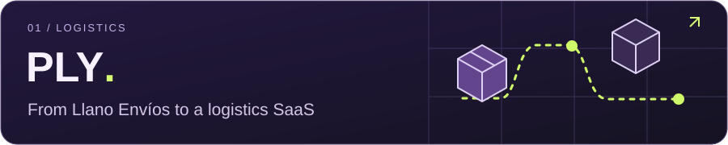
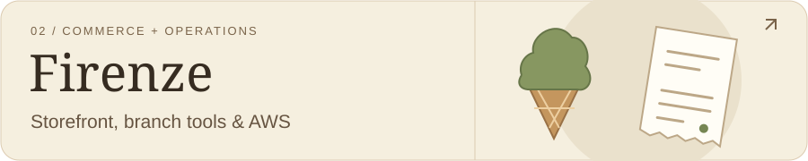
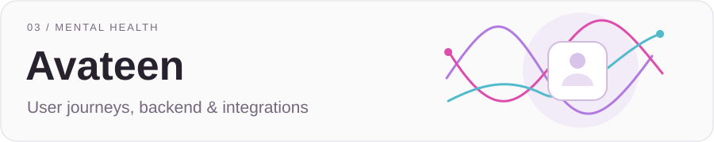
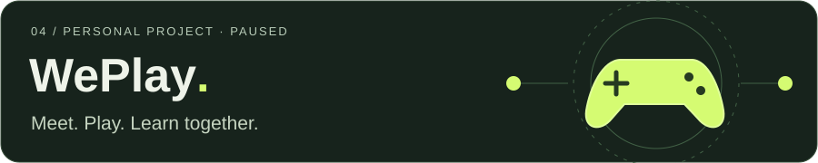

  

  
  
  

## Hi, I'm Fran.

I'm a **Full Stack Developer building at Brace Developers**, based in Lobos, Buenos Aires, Argentina. I work with clients and teams on web products: interfaces, backend services, integrations and AWS infrastructure.

I like talking to the people who use what I build, making interfaces feel good and understanding how the system works behind them. Lately, I've been spending more time on infrastructure, deployment workflows and AI-assisted development.

## A few things I've been building

Frontend, backend and operational workflows for a logistics SaaS serving multiple organizations. Built with **Brace Developers**. [Visit PLY ↗](https://www.ply-tech.com/)

A storefront and operations system for an ice cream shop and café. Interfaces, backend, AWS infrastructure and Android integration for receipt printing. [Visit Firenze ↗](https://heladeriafirenze.com/)

Work on interfaces, user flows, backend services and integrations for a mental health support platform, with **Brace Developers**.

A personal idea I want to return to: a welcoming place to find teammates, enjoy a game and learn together, whatever your experience or personality. **Currently paused.**

## What I work with

**Interfaces** &nbsp; TypeScript · React · Next.js · Tailwind CSS 
**Backend & data** &nbsp; Node.js · NestJS · PostgreSQL 
**Infrastructure & delivery** &nbsp; AWS · Docker · GitHub Actions

More about my technical experience

- **Interfaces:** responsive layouts, accessible interaction states and user flows.
- **Backend and data:** REST APIs, tRPC, TypeORM, Drizzle and Redis.
- **AWS infrastructure:** CDK, CloudFormation, ECS on EC2, RDS, S3 and SQS.
- **Delivery and operations:** CI/CD, IAM permissions, secrets management and CloudWatch.

Firenze brought several of these areas together: storefront UX, branch operations, API contracts, infrastructure as code and deployment workflows.

### AI, used responsibly

I use AI and agents to research, explore alternatives, implement and review code. I set the scope, review the changes and test the result. They've become part of how I work, alongside conversations with clients and hands-on product development.

## Got something in mind?

I'd like to work with teams where I can get involved in the product, talk to clients and users, and build with autonomy.

**[Let's talk ↗](mailto:porcielfranciscoramon@gmail.com)** &nbsp; / &nbsp; **[See my work ↗](https://www.frannpor-dev.com/)**

Lobos, Buenos Aires · English B2 · Games, music and ideas worth building.

---

En español

Soy **Full Stack Developer en Brace Developers** y vivo en Lobos, Buenos Aires. Trabajo con clientes y equipos en aplicaciones web: desde los flujos y las interfaces hasta el backend, las integraciones y la infraestructura.

Me gusta entender cómo se usa un producto, cuidar los detalles de la interfaz y conectar las partes del sistema. Mi experiencia incluye logística, comercio electrónico, gestión de operaciones y productos de salud mental.

En proyectos como PLY, Avateen y Firenze fui ampliando mi trabajo con TypeScript, React, Next.js, NestJS, PostgreSQL y servicios AWS. También trabajé en infraestructura como código, contenedores, permisos, gestión de secretos y flujos de despliegue.

Uso IA y agentes para investigar, explorar alternativas, desarrollar y revisar. Defino el alcance y valido el código y el resultado antes de incorporar cambios al proyecto.

WePlay es una idea propia que quiero retomar: un espacio donde gente con distintas formas de ser y niveles de experiencia pueda encontrarse, jugar y aprender en comunidad.

[Portfolio](https://www.frannpor-dev.com/) · [LinkedIn](https://www.linkedin.com/in/frannpor/) · [Contacto](mailto:porcielfranciscoramon@gmail.com)

